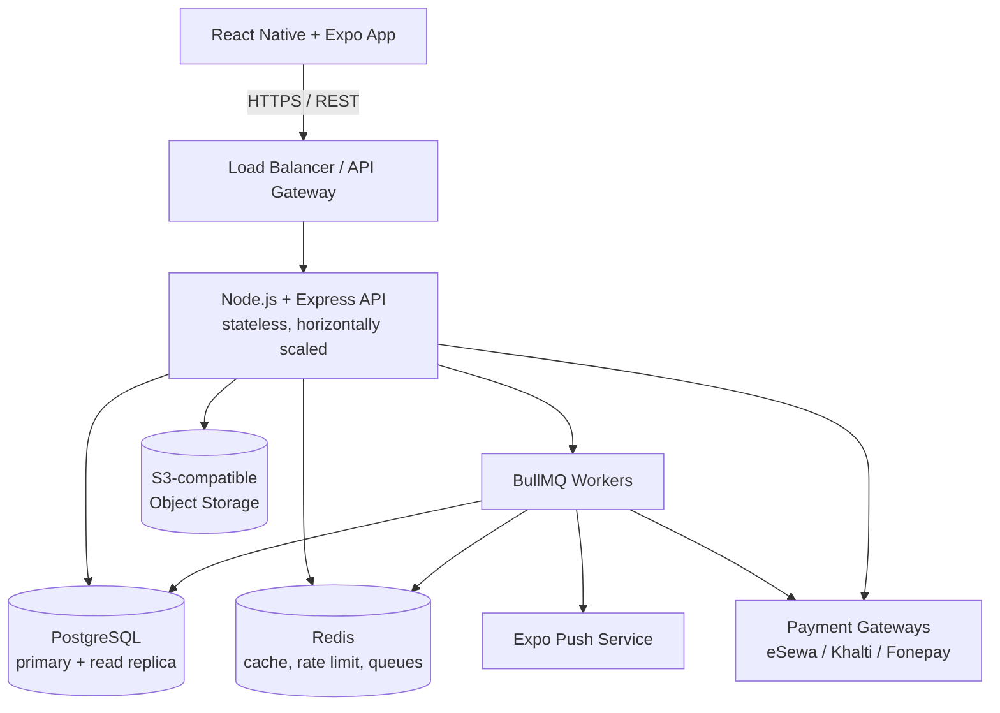
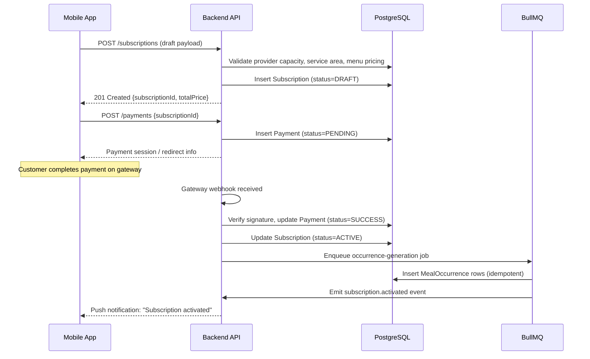

# GharKhana — Architecture

## Document Control

| Field | Value |
|---|---|
| Status | v1.0 — source of truth for system design decisions |
| Related docs | DATABASE.md, SUBSCRIPTION_ENGINE.md, SECURITY.md |

## 1. Architecture Style

Mobile-first client-server architecture with a modular monolith backend (explicitly **not** microservices at MVP — see §14 for the reasoning).



## 2. Confirmed Initial Stack

| Layer | Choice | Purpose |
|---|---|---|
| Mobile | React Native + Expo | Customer/provider mobile application |
| Navigation | Expo Router | File-based mobile navigation |
| Language | TypeScript (strict) | Shared type safety across mobile + backend |
| Client state | Zustand | UI-local state (not server data) |
| Server cache | TanStack Query | API fetching, caching, mutation state, retries |
| Backend | Node.js + Express | REST API |
| Database | PostgreSQL 15+ | Primary relational database, source of truth |
| ORM | Drizzle ORM | Database access, migrations, type-safe schema |
| Cache/queue broker | Redis | Rate limiting, caching, BullMQ backing store |
| Jobs | BullMQ | Recurring occurrence generation, notifications, payouts |
| Push | Expo Notifications / Expo Push Service | Push notifications |
| Storage | S3-compatible object storage | Provider documents, menu/profile images |
| Error tracking | Sentry (or equivalent) | Crash/exception monitoring, mobile + backend |
| Metrics | Prometheus + Grafana (or hosted equivalent) | Backend request/queue metrics |
| Logging | Structured JSON logs (pino) → centralized log store | Debugging, audit correlation |
| Testing | Jest + React Native Testing Library + Supertest | Unit, component, and API integration tests |
| CI/CD | GitHub Actions | Lint, typecheck, test, build, deploy |

## 3. Mobile Architecture

One Expo application with role-based navigation, decided at auth time from `User.role`.

```text
Expo App
│
├── Authentication
│
├── Customer Navigation
│   ├── Home
│   ├── Discover
│   ├── Subscriptions (calendar-first)
│   ├── Calendar
│   └── Profile
│
└── Provider Navigation
    ├── Dashboard
    ├── Menu
    ├── Subscriptions
    ├── Preparation
    └── Profile
```

Delivery-partner and admin surfaces are **not** part of the customer/provider Expo app at MVP: delivery partners use a minimal companion flow (in-app or a lightweight web view — decision tracked in ROADMAP.md), and admin uses a separate internal web console. This keeps the primary mobile bundle small and the review-facing surface simple.

## 4. Mobile Layers

```text
Screens
  ↓
Feature Components
  ↓
Hooks (useSubscription, useProviderDashboard, ...)
  ↓
TanStack Query (server state) / Zustand (UI state)
  ↓
API Client (typed, generated or hand-written from packages/types)
  ↓
Backend
```

**Rule:** UI components never contain API implementation details (URLs, auth headers, retry logic) directly — that lives in the API client layer, and business rules (pricing, cutoff, capacity) are never re-implemented client-side; the client only reflects what the server returns.

## 5. Backend Modules

Organized as a modular monolith — one deployable service, clearly separated internal modules, each owning its own data access:

```text
auth
users
providers
menus
subscriptions
meal-occurrences   ← the subscription engine lives here
locations
payments
deliveries
notifications
reviews
admin
```

Each module exposes a small internal service interface to other modules (e.g., `payments` calls `subscriptions.getAuthoritativePrice(subscriptionId)` rather than querying the `subscriptions` table directly) so that splitting a module into its own service later — if the platform's scale ever demands it — does not require rewriting call sites, only the transport.

## 6. Request Lifecycle (Sequence)

Example: customer creates a subscription.



## 7. Background Jobs

BullMQ/Redis workers handle:

| Job | Trigger | Notes |
|---|---|---|
| Occurrence generation | Subscription activation; nightly rolling-window cron | Idempotent — see SUBSCRIPTION_ENGINE.md §4 |
| Upcoming meal reminders | Scheduled, per occurrence | Deduplicated by `(userId, occurrenceId, type)` |
| Provider preparation notifications | Scheduled, per provider per day | Aggregates all occurrences for that date |
| Subscription renewal reminders | N days before `end_date` | Configurable lead time |
| Payment reconciliation | Hourly cron + webhook-triggered | Cross-checks gateway vs. internal `payments` |
| Provider payout processing | Weekly cron | Reads `wallets`/`ledger_entries`, creates `provider_payouts` |
| Cleanup tasks | Nightly | Expired draft subscriptions, stale refresh tokens |

All jobs are designed to be **safely re-run**: a job crashing mid-execution and being retried must never produce duplicate side effects (duplicate occurrences, duplicate notifications, duplicate payouts). This is enforced via unique constraints (DATABASE.md) and idempotency keys, not by "being careful."

## 8. API

REST API under `/api/v1`. The mobile app communicates **only** through documented API contracts — no direct database or object storage access from the client, ever (object storage uploads go through short-lived signed URLs issued by the API).

Versioning policy: breaking changes require a new version prefix (`/api/v2`); additive changes (new optional fields, new endpoints) do not. See API_SPEC.md §Versioning.

## 9. Caching

- **TanStack Query** handles client-side server-state caching, with sensible `staleTime` per resource type (e.g., menu data cached longer than subscription calendar data).
- **Redis** may cache:
  - Frequently accessed provider discovery data (short TTL, e.g., 60s, invalidated on provider/menu update)
  - Rate limit counters
  - Short-lived operational data (e.g., in-flight idempotency key locks)
- Transactional subscription and payment state remains **PostgreSQL-authoritative** at all times — Redis is never the system of record for money or subscription status.

## 10. Offline Behavior

The app may cache previously loaded menus, provider profiles, subscription schedules, and user profile data for read access while offline or on a poor connection.

Core subscription modifications, payments, and status transitions **require** server validation — the app surfaces a clear "you're offline, this action needs a connection" state rather than queuing and silently replaying business-critical mutations. The MVP is explicitly **not** offline-first; this is a deliberate scope boundary (see PRD.md §12).

## 11. File Storage

Object storage (S3-compatible) is used for provider verification documents, provider profile images, and menu images. Files are never stored directly in PostgreSQL.

- Verification documents: private bucket, access only via expiring signed URLs issued to authorized admin roles (SECURITY.md §5).
- Profile/menu images: may sit behind a public CDN-fronted bucket since they are intentionally public-facing.

## 12. Deployment & Environments

The backend is built to remain platform-agnostic (no hard dependency on a specific cloud provider's proprietary services beyond S3-compatible storage and standard Postgres/Redis).

```text
API server (containerized, horizontally scalable)
+
PostgreSQL (managed, primary + read replica)
+
Redis (managed)
+
Object storage (S3-compatible)
```

| Environment | Purpose | Data |
|---|---|---|
| `local` | Developer machines, docker-compose | Seed/fixture data only |
| `staging` | Pre-production validation, QA, payment gateway sandbox | Synthetic/test data |
| `production` | Live traffic | Real customer/provider data |

Exact hosting provider (e.g., regional cloud vs. local Nepal hosting for data residency) remains an implementation decision — flagged as an open item in README.md and ROADMAP.md.

## 13. CI/CD Pipeline

```text
On pull request:
  lint → typecheck → unit tests → API integration tests → build

On merge to main:
  (all of the above) → build container image → deploy to staging
  → run smoke tests against staging → manual approval gate → deploy to production
```

Database migrations run as a distinct, reviewed step **before** the new application version is deployed, and are always backward-compatible with the previous version for the duration of a rolling deploy (DATABASE.md §22).

## 14. Why a Modular Monolith, Not Microservices

At MVP scale (single pilot city, hundreds to low thousands of daily active users), microservices add operational overhead — network calls, distributed tracing, service discovery — without a corresponding benefit. The modular monolith gives:

- Simple, fast local development and CI
- Transactional consistency across modules that are tightly coupled today (subscriptions ↔ payments ↔ occurrences)
- A clear seam (module boundaries in §5) to extract a service later if a specific module (e.g., notifications, or occurrence generation) needs independent scaling

This decision should be revisited only when a specific module demonstrates a scaling or team-ownership need that the monolith can no longer serve well — not preemptively.

## 15. Observability

- **Structured logging:** every log line includes `requestId`, `userId` (if authenticated), and `module`, enabling correlation across a single request's path through the modular monolith and into background jobs it triggers.
- **Metrics:** request latency (P50/P95/P99) per route, queue depth and job failure rate per BullMQ queue, database connection pool saturation.
- **Tracing:** at MVP, request-scoped structured logs are sufficient; distributed tracing (OpenTelemetry) is a Phase 8 addition if/when services are split out.
- **Alerting thresholds** (initial): API error rate > 2% over 5 minutes, job queue failure rate > 5%, payment webhook failure rate > 1%, database replica lag > 30s.

## 16. Scaling Considerations

| Concern | MVP approach | Scale-out path |
|---|---|---|
| API throughput | Single stateless instance, vertically sized | Horizontal scaling behind load balancer (already stateless-ready) |
| Database reads | Single primary | Add read replica for discovery/reporting queries |
| Occurrence generation | Single BullMQ worker | Multiple workers with per-provider or per-date sharded job keys to avoid contention |
| Notification fan-out | Synchronous-ish per event | Batch/queue-based fan-out once user base grows past low thousands |
| Meal occurrence table growth | Standard indexed table | Partition by `scheduled_date` (DATABASE.md §10) once row counts warrant it |

## 17. Architectural Principles

1. Backend is authoritative for all business rules — pricing, capacity, cutoff, status.
2. `Subscription` and `MealOccurrence` are always separate entities (DOMAIN_MODEL.md §24).
3. Mobile UI must never duplicate business logic; it renders server-provided state.
4. Payment state is server-authoritative and driven by verified gateway webhooks, never client callbacks.
5. All recurring/background operations must be idempotent.
6. Provider/customer data is isolated by authorization at the query layer, not just the API layer.
7. Every important state transition is auditable via `audit_logs`.
8. No client ever talks directly to the database, object storage, or payment gateway without going through the API.
