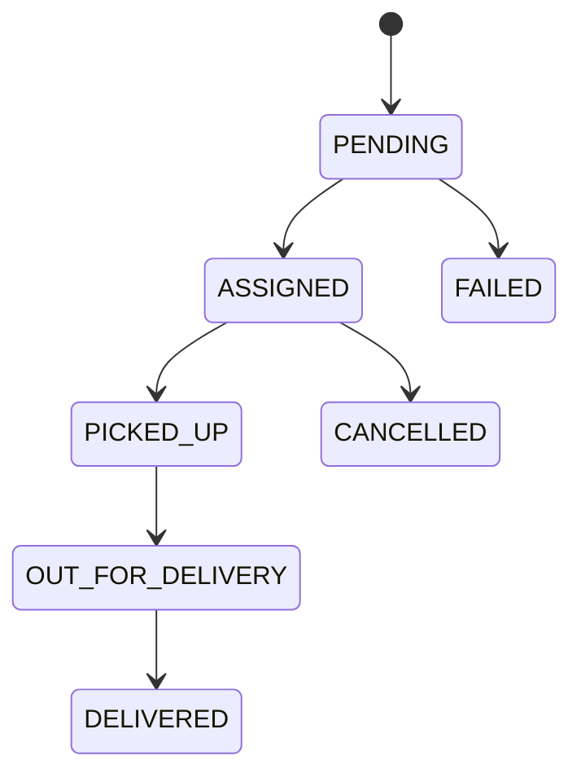

# GharKhana — Delivery

## Document Control

| Field | Value |
|---|---|
| Status | v1.0 |
| Related docs | DOMAIN_MODEL.md §4, §12, DATABASE.md §11 |

## 1. Purpose

Delivery converts prepared `MealOccurrence`s (status `READY`) into completed customer deliveries, tracked through a small, auditable status machine — not a full logistics platform.

## 2. Delivery Models

**MVP model — provider-managed or platform-assigned, one occurrence per delivery:**

```text
Provider → Delivery Partner → Customer
```

Each `Delivery` row maps 1:1 to a `MealOccurrence` (DATABASE.md §11). This is intentionally simple: no route optimization, no multi-stop batching logic to build or debug during initial launch.

**Future model (Phase 8) — batched, multi-stop:**

```text
Provider → Platform Batch (multiple occurrences, one zone, one time window)
         → Delivery Partner
         → Multiple Customers (sequenced stops)
```

Batching becomes valuable once a single provider or zone has enough simultaneous deliveries to justify route sequencing — premature at MVP scale (PRD.md §12 explicitly excludes live GPS fleet tracking and complex logistics for the same reason).

**Decision needed before Phase 5 build starts:** is delivery platform-managed (GharKhana recruits/manages delivery partners) or provider-managed (each household arranges its own delivery, GharKhana just tracks status)? This changes who assigns `Delivery.deliveryPartnerId` and is tracked as an open question (PRD.md §15).

## 3. Delivery Status



`Delivery.status` transitions are mirrored (not duplicated logic, just reflected) into the parent `MealOccurrence.status` where relevant (e.g., `DELIVERED` → occurrence `DELIVERED`), keeping the occurrence as the single canonical "where is my meal" answer for the customer app.

## 4. Delivery Information Exposure

| Recipient | Sees |
|---|---|
| Delivery partner | Customer name, delivery address, contact info necessary for delivery, delivery instructions, meal/occurrence identifier |
| Provider | Customer's delivery address and instructions only once a subscription is active (not during discovery) |
| Customer | Assigned delivery partner's first name and a masked contact channel (not raw phone number) |

Do not expose unnecessary personal data at any layer — see SECURITY.md §4 for the full address-privacy model.

## 5. Service Area & Serviceability

Providers define one or more `ServiceArea` records (DOMAIN_MODEL.md §4). A subscription can only be confirmed if the customer's `CustomerLocation` falls within at least one of the provider's active service areas — this check happens server-side at `POST /subscriptions` and is never bypassable from the client.

## 6. Delivery Timing & Cutoff Interaction

Delivery scheduling must account for three sequential windows for any given meal:

```text
Customer modification cutoff  →  Provider preparation time  →  Delivery time  →  Target delivery time
```

Each provider's `CutoffPolicy` (SUBSCRIPTION_ENGINE.md §9) must leave enough buffer for preparation and delivery — this is a provider-configuration validation the admin/onboarding flow should sanity-check (e.g., reject a cutoff of "30 minutes before delivery" for a provider whose typical prep time is 2 hours).

**Illustrative SLA targets (MVP, single pilot city):**

| Stage | Target |
|---|---|
| Provider marks `PREPARING` → `READY` | Within the provider's declared prep window |
| `READY` → `PICKED_UP` | Within 15 minutes of `READY` |
| `PICKED_UP` → `DELIVERED` | Within 45 minutes for same-zone deliveries |

These are operational targets to monitor (ARCHITECTURE.md §15), not hard technical constraints enforced by the system.

## 7. Failed Delivery

A failed delivery records:

| Field | Notes |
|---|---|
| `failureReason` | One of `CUSTOMER_UNAVAILABLE`, `INCORRECT_ADDRESS`, `PROVIDER_DELAY`, `DELIVERY_ISSUE`, `OPERATIONAL_CANCELLATION` |
| Timestamp | When the failure was recorded |
| Delivery partner | Who attempted the delivery |
| Attempt status | Whether a retry was attempted same-day |
| Resolution | Refund, credit, redelivery, or no-action, per admin/dispute review |

A failed delivery on a paid `MealOccurrence` should generate a `Dispute` candidate or an automatic credit per policy — never leave the customer's payment and the failed meal unreconciled (see PAYMENTS.md §5).

## 8. Proof of Delivery (Phase 7+)

Optional future enhancements, explicitly out of MVP scope:

- OTP-based delivery confirmation
- Photo proof of handoff
- Customer in-app confirmation tap

At MVP, delivery partner-reported status transitions are the system of record; there is no cryptographic or photographic proof requirement.

## 9. Live Tracking — Explicit Non-Goal at MVP

Per PRD.md §12, live GPS fleet tracking is out of scope for MVP. The customer sees **status-based** tracking (`PENDING → ASSIGNED → PICKED_UP → OUT_FOR_DELIVERY → DELIVERED`) rather than a live map. This keeps the delivery-partner app requirements minimal (a status-update button, not a background location service) and avoids battery/privacy tradeoffs before there's a proven need.

## 10. MVP Scope

Keep delivery management to status tracking against the state machine in §3, one occurrence per delivery (§2), and the exposure rules in §4. Implement batching, route optimization, and live GPS tracking only once operational volume in a single zone justifies the added complexity (ROADMAP.md Phase 8).
