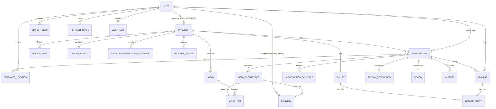

# GharKhana — Domain Model

## Document Control

| Field | Value |
|---|---|
| Status | v1.0 — source of truth for entity design |
| Related docs | DATABASE.md (physical schema), SUBSCRIPTION_ENGINE.md (behavior) |

## 1. Domain Overview



The two core relationship chains:

```text
Customer → Subscription → SubscriptionSchedule → MealOccurrence → Delivery
Provider → Menu → MenuItem → Subscription
```

## 2. User

Represents an authenticated platform account. A single `User` row backs every role — role-specific data lives in satellite tables (`Provider`, delivery-partner metadata).

| Attribute | Type | Notes |
|---|---|---|
| id | UUID | PK |
| name | string(120) | Display name |
| email | string \| null | Unique when present |
| phone | string \| null | Unique when present, E.164 format |
| passwordHash | string \| null | Null if auth is OTP-only |
| role | enum | See below |
| status | enum | `ACTIVE`, `SUSPENDED`, `DEACTIVATED` |
| phoneVerifiedAt | timestamp \| null | |
| emailVerifiedAt | timestamp \| null | |
| createdAt | timestamp | |
| updatedAt | timestamp | |

**Roles:** `CUSTOMER`, `PROVIDER`, `DELIVERY_PARTNER`, `ADMIN`, `SUPER_ADMIN`

**Invariant:** At least one of `email` or `phone` must be present and verified before a `User` can create a `Subscription` or a `Provider` profile.

## 3. Provider

Represents a household or home food provider. One `User` (role=`PROVIDER`) has exactly one `Provider` profile.

| Attribute | Type | Notes |
|---|---|---|
| id | UUID | PK |
| userId | UUID | FK → User, unique |
| providerType | enum | `HOME_COOK`, `HOUSEHOLD`, `SMALL_HOME_KITCHEN` |
| displayName | string(120) | Public name |
| description | text | |
| verificationStatus | enum | `PENDING`, `IN_REVIEW`, `VERIFIED`, `REJECTED`, `SUSPENDED` |
| dailyCapacity | jsonb | Per-meal-type capacity, e.g. `{"LUNCH": 30, "DINNER": 20}` |
| rating | decimal(2,1) \| null | Denormalized average, recomputed from `Review` |
| ratingCount | integer | Denormalized count |
| status | enum | `ACTIVE`, `PAUSED_BY_PROVIDER`, `SUSPENDED_BY_ADMIN` |
| createdAt / updatedAt | timestamp | |

**Invariant:** A `Provider` cannot receive new `Subscription`s while `verificationStatus != VERIFIED` or `status != ACTIVE`.

## 4. ServiceArea

Formalizes the "service area" previously modeled as a loose JSON blob on `Provider`. Split out because a provider may define multiple discontiguous zones (e.g., two neighborhoods) with different eligibility.

| Attribute | Type | Notes |
|---|---|---|
| id | UUID | PK |
| providerId | UUID | FK → Provider |
| label | string(80) | e.g. "Baneshwor Zone" |
| polygon | geojson (jsonb) | MVP: simple polygon or radius; see DATABASE.md §5a |
| centerLat / centerLng | decimal | Used for radius fallback |
| radiusMeters | integer \| null | Alternative to polygon for MVP simplicity |
| isActive | boolean | |

**Rule:** A `CustomerLocation` is only serviceable by a `Provider` if it falls within at least one active `ServiceArea` belonging to that provider. Server-enforced at subscription creation (see API_SPEC.md, `POST /subscriptions`).

## 5. CutoffPolicy

Formalizes the modification cutoff, previously an implicit "provider-configured" value.

| Attribute | Type | Notes |
|---|---|---|
| id | UUID | PK |
| providerId | UUID | FK → Provider, one active policy per provider (MVP) |
| mealType | enum \| null | Null = applies to all meal types |
| cutoffOffsetHours | integer | Hours before scheduled delivery time that modifications lock, e.g. `12` |
| cutoffTimeOfDay | time \| null | Alternative fixed clock cutoff, e.g. "20:00" the day before |
| timezone | string | Always `Asia/Kathmandu` at MVP |

Exactly one of `cutoffOffsetHours` or `cutoffTimeOfDay` is set. See SUBSCRIPTION_ENGINE.md §9 for the resolution algorithm.

## 6. Menu

A collection of meals offered by a provider.

| Attribute | Type | Notes |
|---|---|---|
| id | UUID | PK |
| providerId | UUID | FK → Provider |
| name | string(120) | |
| description | text | |
| status | enum | `DRAFT`, `PUBLISHED`, `ARCHIVED` |
| createdAt / updatedAt | timestamp | |

## 7. MenuItem

An individual meal that can be selected as a default or override.

| Attribute | Type | Notes |
|---|---|---|
| id | UUID | PK |
| menuId | UUID | FK → Menu |
| name | string(120) | |
| description | text | |
| price | numeric(10,2) | NPR, authoritative source for pricing |
| mealType | enum | `BREAKFAST`, `LUNCH`, `DINNER`, `SNACKS` |
| availability | boolean | Toggled off when temporarily unavailable |
| dietaryTags | jsonb (string[]) | e.g. `["vegetarian", "gluten-free"]` |
| imageUrl | string \| null | Object storage reference |
| createdAt / updatedAt | timestamp | |

**Invariant:** `price` changes never retroactively affect already-generated `MealOccurrence.unitPrice` — those are snapshotted at generation/customization time (see SUBSCRIPTION_ENGINE.md §10).

## 8. CustomerLocation

A saved delivery location.

| Attribute | Type | Notes |
|---|---|---|
| id | UUID | PK |
| customerId | UUID | FK → User |
| label | string(40) | "Office", "Home" |
| addressLine | text | Private — see SECURITY.md §4 |
| landmark | string \| null | |
| latitude / longitude | decimal | |
| instructions | text \| null | Gate code, floor, etc. |
| isDefault | boolean | |
| createdAt / updatedAt | timestamp | |

**Rule:** Exact `addressLine` is never exposed to any party other than the owning customer, the fulfilling provider (once subscribed), and the assigned delivery partner (only while a delivery is active).

## 9. Subscription

The customer's recurring agreement with a provider.

| Attribute | Type | Notes |
|---|---|---|
| id | UUID | PK |
| customerId | UUID | FK → User |
| providerId | UUID | FK → Provider |
| locationId | UUID | FK → CustomerLocation |
| startDate / endDate | date | Inclusive billing period |
| frequency | enum | `WEEKLY`, `MONTHLY` |
| mealType | enum | `BREAKFAST`, `LUNCH`, `DINNER`, `SNACKS` |
| status | enum | See below |
| quantity | integer | Meals per delivery, default 1 |
| totalPrice | numeric(10,2) | Server-calculated, authoritative |
| cutoffPolicyId | UUID | Denormalized snapshot of the policy in effect at creation |
| promoRedemptionId | UUID \| null | FK → PromoRedemption |
| createdAt / updatedAt | timestamp | |

**Statuses:** `DRAFT` → `PENDING_PAYMENT` → `ACTIVE` ⇄ `PAUSED` → `COMPLETED` | `CANCELLED`

Full transition rules: SUBSCRIPTION_ENGINE.md §12.

## 10. SubscriptionSchedule

Defines the recurring default template.

| Attribute | Type | Notes |
|---|---|---|
| id | UUID | PK |
| subscriptionId | UUID | FK → Subscription |
| dayOfWeek | integer (0–6) | 0 = Sunday, per ISO-ish convention documented in DATABASE.md |
| defaultMenuItemId | UUID | FK → MenuItem |
| quantity | integer | Overridable per-day quantity |

**Constraint:** unique `(subscriptionId, dayOfWeek)`.

## 11. MealOccurrence

Represents one actual scheduled meal — the operational unit of the entire platform.

| Attribute | Type | Notes |
|---|---|---|
| id | UUID | PK |
| subscriptionId | UUID | FK → Subscription |
| scheduledDate | date | |
| menuItemId | UUID | FK → MenuItem (may differ from the schedule's default if customized) |
| quantity | integer | |
| unitPrice | numeric(10,2) | Snapshotted at generation/customization time |
| totalPrice | numeric(10,2) | `unitPrice × quantity` |
| status | enum | See below |
| customizationSource | enum | `DEFAULT`, `CUSTOMER_OVERRIDE`, `PROVIDER_ADJUSTED`, `ADMIN_ADJUSTED` |
| cutoffAt | timestamp | Computed at generation time from the CutoffPolicy snapshot |
| createdAt / updatedAt | timestamp | |

**Statuses:** `SCHEDULED` → `CONFIRMED` → `PREPARING` → `READY` → `PICKED_UP` → `DELIVERED`, with side-branches `SKIPPED`, `CANCELLED`, `FAILED`.

**Constraint:** unique `(subscriptionId, scheduledDate)` — this is the idempotency guarantee referenced throughout SUBSCRIPTION_ENGINE.md.

## 12. Delivery

Represents fulfillment of exactly one `MealOccurrence` at MVP (batching multiple occurrences into one delivery run is a Phase 8 concern, see DELIVERY.md §2).

| Attribute | Type | Notes |
|---|---|---|
| id | UUID | PK |
| mealOccurrenceId | UUID | FK → MealOccurrence, unique at MVP |
| deliveryPartnerId | UUID \| null | FK → User (role=DELIVERY_PARTNER) |
| status | enum | `PENDING`, `ASSIGNED`, `PICKED_UP`, `OUT_FOR_DELIVERY`, `DELIVERED`, `FAILED`, `CANCELLED` |
| assignedAt / pickedUpAt / deliveredAt | timestamp \| null | |
| failureReason | enum \| null | See DELIVERY.md §7 |
| deliveryNotes | text \| null | |
| proofType | enum \| null | `OTP`, `PHOTO`, `CUSTOMER_CONFIRMATION` — Phase 7+ |

## 13. Payment

Represents a customer-facing financial transaction (a charge, not a ledger entry — see §16 `LedgerEntry` for double-entry bookkeeping).

| Attribute | Type | Notes |
|---|---|---|
| id | UUID | PK |
| customerId | UUID | FK → User |
| subscriptionId | UUID | FK → Subscription |
| amount | numeric(10,2) | NPR |
| currency | string(3) | `NPR` at MVP |
| gateway | enum | `ESEWA`, `KHALTI`, `FONEPAY` (see PAYMENTS.md §2) |
| providerReference | string | Gateway transaction ID |
| status | enum | `PENDING`, `SUCCESS`, `FAILED`, `REFUNDED`, `PARTIALLY_REFUNDED` |
| idempotencyKey | string | Unique — prevents duplicate charge creation |
| paidAt | timestamp \| null | |
| createdAt / updatedAt | timestamp | |

## 14. Wallet & LedgerEntry

Introduced to make provider earnings auditable rather than "conceptually derived." One `Wallet` per `Provider`; every credit/debit is a `LedgerEntry` (append-only, double-entry style).

**Wallet**

| Attribute | Type | Notes |
|---|---|---|
| id | UUID | PK |
| providerId | UUID | FK → Provider, unique |
| balance | numeric(12,2) | Denormalized, must always equal `sum(LedgerEntry.amount)` for that wallet |
| currency | string(3) | `NPR` |

**LedgerEntry**

| Attribute | Type | Notes |
|---|---|---|
| id | UUID | PK |
| walletId | UUID | FK → Wallet |
| type | enum | `MEAL_EARNING`, `PLATFORM_FEE`, `PAYOUT`, `ADJUSTMENT`, `REFUND_DEDUCTION` |
| amount | numeric(12,2) | Signed (+credit / -debit) |
| referenceType | enum | `MEAL_OCCURRENCE`, `PROVIDER_PAYOUT`, `DISPUTE` |
| referenceId | UUID | Polymorphic reference |
| createdAt | timestamp | Immutable, never updated |

**Invariant:** `LedgerEntry` rows are never updated or deleted. Corrections are made with a new offsetting entry.

## 15. ProviderPayout

| Attribute | Type | Notes |
|---|---|---|
| id | UUID | PK |
| providerId | UUID | FK → Provider |
| amount | numeric(12,2) | |
| status | enum | `SCHEDULED`, `PROCESSING`, `PAID`, `FAILED` |
| periodStart / periodEnd | date | Payout cycle window (weekly, PAYMENTS.md §6) |
| payoutReference | string \| null | Bank/gateway reference |
| paidAt | timestamp \| null | |

## 16. PromoCode & PromoRedemption

| Entity | Key attributes |
|---|---|
| PromoCode | id, code (unique), discountType (`PERCENT` \| `FIXED`), value, maxRedemptions, validFrom, validTo, isActive |
| PromoRedemption | id, promoCodeId, subscriptionId, customerId, discountAmount, redeemedAt |

## 17. DeviceToken & RefreshToken

| Entity | Key attributes | Purpose |
|---|---|---|
| DeviceToken | id, userId, expoPushToken, platform, lastSeenAt | Push notification delivery target |
| RefreshToken | id, userId, tokenHash, expiresAt, revokedAt, replacedByTokenId | Refresh token rotation (SECURITY.md §1) |

## 18. Review

Customer feedback about a provider, scoped to a completed subscription.

| Attribute | Type | Notes |
|---|---|---|
| id | UUID | PK |
| customerId | UUID | FK → User |
| providerId | UUID | FK → Provider |
| subscriptionId | UUID | FK → Subscription, unique — one review per subscription |
| rating | integer (1–5) | |
| comment | text \| null | |
| status | enum | `PUBLISHED`, `FLAGGED`, `REMOVED` |
| createdAt | timestamp | |

## 19. ProviderVerificationDocument

| Attribute | Type | Notes |
|---|---|---|
| id | UUID | PK |
| providerId | UUID | FK → Provider |
| documentType | enum | `CITIZENSHIP`, `KITCHEN_PHOTO`, `FOOD_HANDLING_DECLARATION`, `OTHER` |
| objectStorageKey | string | Private bucket key, never a public URL |
| status | enum | `PENDING`, `APPROVED`, `REJECTED` |
| reviewedByAdminId | UUID \| null | |
| reviewedAt | timestamp \| null | |

## 20. Dispute

| Attribute | Type | Notes |
|---|---|---|
| id | UUID | PK |
| subscriptionId | UUID | FK → Subscription |
| raisedByUserId | UUID | |
| category | enum | `QUALITY`, `NON_DELIVERY`, `BILLING`, `OTHER` |
| status | enum | `OPEN`, `IN_REVIEW`, `RESOLVED`, `REJECTED` |
| resolutionNote | text \| null | |
| resolvedByAdminId | UUID \| null | |
| createdAt / resolvedAt | timestamp | |

## 21. Notification

| Attribute | Type | Notes |
|---|---|---|
| id | UUID | PK |
| userId | UUID | FK → User |
| type | enum | See NOTIFICATIONS.md §2–4 for full catalog |
| title / body | string / text | |
| data | jsonb | Deep-link payload |
| priority | enum | `HIGH`, `NORMAL`, `LOW` |
| readAt | timestamp \| null | |
| createdAt | timestamp | |

## 22. AuditLog

| Attribute | Type | Notes |
|---|---|---|
| id | UUID | PK |
| actorUserId | UUID \| null | Null for system/scheduled actions |
| action | string | e.g. `SUBSCRIPTION_CANCELLED`, `PROVIDER_VERIFIED` |
| entityType | string | |
| entityId | UUID | |
| beforeState | jsonb \| null | |
| afterState | jsonb \| null | |
| createdAt | timestamp | Immutable |

## 23. Domain Events

The following are the canonical domain events other systems (notifications, jobs, analytics) react to. All are emitted from the backend after a successful, committed state transition — never speculatively.

`subscription.created`, `subscription.activated`, `subscription.paused`, `subscription.resumed`, `subscription.cancelled`, `subscription.completed`, `meal_occurrence.generated`, `meal_occurrence.customized`, `meal_occurrence.skipped`, `meal_occurrence.status_changed`, `payment.succeeded`, `payment.failed`, `payment.refunded`, `delivery.assigned`, `delivery.delivered`, `delivery.failed`, `provider.verified`, `review.created`, `dispute.opened`, `dispute.resolved`.

## 24. Entity Principle

`Subscription` and `MealOccurrence` must remain separate entities, always. The subscription defines the plan; the occurrence represents the actual operational meal. This separation is what enables individual skips, modifications, refunds, delivery tracking, and failure handling — collapsing it is the single most costly architectural mistake this platform could make.
