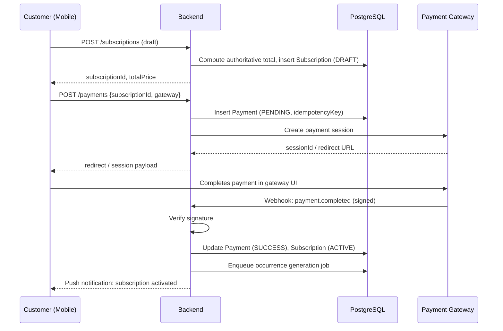

# GharKhana — Payments

## Document Control

| Field | Value |
|---|---|
| Status | v1.0 |
| Related docs | DOMAIN_MODEL.md §13–15, DATABASE.md §12–14, SECURITY.md §6 |

## 1. Payment Model

The system supports subscription-level payment (one charge activates a subscription and its full billing period) while keeping individual `MealOccurrence`s financially traceable for refunds, skips, and disputes. `Payment` records the customer-facing charge; `Wallet`/`LedgerEntry` record the provider-facing double-entry bookkeeping (DOMAIN_MODEL.md §14).

## 2. Payment Gateways (Nepal Market)

| Gateway | Role at launch | Notes |
|---|---|---|
| **eSewa** | Primary candidate | Widest wallet adoption in urban Nepal; well-documented merchant API |
| **Khalti** | Primary candidate | Strong among younger/student demographic; card + wallet support |
| **Fonepay** | Secondary | Bank-linked QR payments, useful for customers without a wallet balance |

**Decision:** launch with **one** gateway (owner: Payments lead, tracked in PRD.md §15/ROADMAP.md); the `gateway` enum on `Payment` and the abstraction in §8 exist specifically so a second gateway can be added without a schema migration.

## 3. Subscription Payment Flow



Steps, in words:
1. Customer selects a subscription plan; server computes the authoritative amount.
2. A `Payment` row is created (`PENDING`) with a client-supplied `Idempotency-Key`.
3. A payment session is created with the chosen gateway; the client is redirected/opens the gateway's checkout.
4. Customer completes payment on the gateway's own UI (GharKhana never handles raw card/wallet credentials — see §9).
5. Gateway sends a signed webhook to `/payments/webhook`.
6. Backend verifies the signature, then updates `Payment.status = SUCCESS`.
7. `Subscription.status` transitions to `ACTIVE`.
8. Meal occurrences become eligible for generation/fulfillment (SUBSCRIPTION_ENGINE.md §4).

If the customer abandons checkout or the gateway reports failure, `Payment.status = FAILED` and `Subscription` remains `PENDING_PAYMENT` (auto-cancelled by a cleanup job after a configurable TTL, e.g., 24 hours).

## 4. Pricing

The server calculates:

```text
total =
  sum(occurrence quantity × authoritative unit price, for every date the schedule generates)
  + applicable delivery fees
  - applicable discounts (promo code)
```

The client may display an estimate, but the **authoritative** amount is always recomputed server-side immediately before creating the `Payment` record — the final amount charged is never taken from client input. Mid-cycle customer overrides that increase the total for a specific occurrence (SUBSCRIPTION_ENGINE.md §5) are billed as an incremental charge against the same subscription rather than reopening the original payment.

## 5. Refunds

Refunds may occur because of:

| Trigger | Typical resolution |
|---|---|
| Provider cancellation (provider can no longer fulfill) | Full refund of affected occurrences |
| Platform cancellation (e.g., provider suspended mid-cycle) | Full refund of remaining unfulfilled occurrences |
| Failed fulfillment (delivery failure not the customer's fault) | Per-occurrence credit or refund, per policy |
| Eligible customer cancellation (before policy-defined threshold) | Pro-rated refund of remaining unfulfilled occurrences |
| Operational failure (platform-side error) | Full refund of affected amount |

Refund policy thresholds (e.g., "cancel within 24 hours of first meal for a full refund") are a business-rule configuration, not hardcoded — tracked as an admin-configurable setting in Phase 4. Every refund is recorded as a `Payment.status` transition (`SUCCESS → REFUNDED` or `PARTIALLY_REFUNDED`) plus an offsetting `LedgerEntry` if the provider had already been credited for the affected occurrence.

## 6. Provider Earnings & Payout Cycle

Provider earnings are derived from completed/eligible meals via the `Wallet`/`LedgerEntry` system (DOMAIN_MODEL.md §14) — never "conceptually derived" at read time from raw payment data.

```text
Gross customer amount for a delivered/eligible occurrence
- platform fee (configurable %, e.g., 15%)
- delivery cost adjustment (if platform-managed delivery, DELIVERY.md §2)
= provider payable amount  →  credited as a MEAL_EARNING ledger entry
```

**Payout cycle:** weekly, computed over a fixed `periodStart`–`periodEnd` window. A `ProviderPayout` row is created in `SCHEDULED` status, processed via bank transfer or the same wallet gateway, and marked `PAID` on confirmation. Failed payouts (`FAILED`) are retried and flagged for admin review, not silently dropped.

## 7. Reconciliation

Every `Payment` carries:

- Internal payment ID
- External gateway transaction/reference ID (`providerReference`)
- Subscription ID
- Amount, currency
- Status
- Timestamps (`createdAt`, `paidAt`)

**Reconciliation job (hourly):** cross-checks the gateway's transaction report/API against internal `payments` records to catch:
- Webhooks that were never received (network failure) — internal record still `PENDING`, gateway shows success → job reconciles and completes the activation flow.
- Webhooks that were received but processing failed silently — caught by comparing final states.

**Webhook handling must be idempotent** on `gatewayTransactionId`: a webhook redelivered by the gateway (a documented behavior of most webhook systems) must never create a second `Payment` or double-activate a subscription.

## 8. Payment Abstraction (MVP → Multi-Gateway)

```text
interface PaymentGatewayAdapter {
  createSession(payment: Payment): SessionResult
  verifyWebhookSignature(rawBody, signatureHeader): boolean
  parseWebhookEvent(rawBody): NormalizedPaymentEvent
  initiateRefund(payment: Payment, amount: Decimal): RefundResult
}
```

Each gateway (eSewa, Khalti, Fonepay) implements this interface; the rest of the payments module (webhook route, reconciliation job, refund flow) is written against the interface, not any single gateway's SDK. This is what makes adding gateway #2 a contained change rather than a rewrite.

## 9. Payment Security & Compliance

- GharKhana **never** stores raw card numbers, CVVs, or wallet credentials — all sensitive payment collection happens on the gateway's hosted checkout page. This keeps GharKhana's PCI-DSS scope at **SAQ-A** (the lowest self-assessment tier), not a full cardholder-data-environment scope.
- Only `providerReference`, amount, currency, status, and timestamps are stored (see §7).
- All webhook signatures are verified against the gateway's shared secret/public key before any field in the payload is trusted (SECURITY.md §6).
- Payment and refund operations are idempotent by design (§7, §5).

## 10. Tax Considerations

VAT invoicing requirements for platform commission (and, separately, for provider earnings if providers cross a formal registration threshold) are a Nepal tax-compliance question that needs Legal/Finance sign-off before launch — tracked as an open item. The `Payment` and `LedgerEntry` schemas retain enough granularity (gross amount, platform fee, net provider amount) to support VAT invoice generation once the policy is finalized.

## 11. MVP Scope

Implement one supported payment gateway first (§2). Keep the payment abstraction provider-independent (§8) so additional gateways can be added without a data model change. Refund policy thresholds and payout cadence are configuration, not code, from day one.
