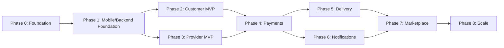

# GharKhana — Roadmap

## Document Control

| Field | Value |
|---|---|
| Status | Phase 0–7 Complete (Backend Modules, Tests & Mobile UI Integrated) · Ready for Phase 8 Scale |
| Related docs | PRD.md, all module-specific docs referenced per phase |

## Development Principle

> Do not build advanced marketplace features before the recurring subscription engine is reliable.

Every phase below is sequenced to protect this principle: the subscription engine (Phase 1–3) ships and proves itself operationally correct (no duplicate occurrences, correct cutoff/capacity enforcement) before payments, delivery, notifications, or marketplace polish are layered on top.

## Phase 0 — Product Foundation (est. 2–3 weeks)

**Goal:** all documentation ratified; no ambiguity blocking Phase 1 engineering.

- Finalize PRD (PRD.md)
- Finalize domain model (DOMAIN_MODEL.md)
- Finalize database schema (DATABASE.md)
- Define API contracts (API_SPEC.md)
- Define mobile navigation (UX_FLOW.md, ARCHITECTURE.md §3)
- Define security model (SECURITY.md)
- Define subscription engine algorithm (SUBSCRIPTION_ENGINE.md)
- **Exit criteria:** payment gateway decision made (PAYMENTS.md §2), delivery model decision made (DELIVERY.md §2), hosting/data-residency decision made (ARCHITECTURE.md §12)

## Phase 1 — Mobile & Backend Foundation (est. 3–4 weeks)

- Expo project scaffold, TypeScript strict mode
- Expo Router navigation shell
- Backend project scaffold (Node.js/Express/Drizzle), CI pipeline (ARCHITECTURE.md §13)
- Authentication (FR-1): registration, login, OTP, refresh rotation
- API client layer, TanStack Query + Zustand setup
- Shared UI/design system components, error/loading states
- **Exit criteria:** a user can register, verify, log in, and receive a valid session on both platforms (iOS/Android)

## Phase 2 — Customer MVP (est. 4–5 weeks)

- Customer profile (FR-2)
- Delivery locations (FR-11)
- Provider discovery (FR-5)
- Provider profile, menu browsing
- Subscription creation flow: weekly/monthly plans, schedule customization (FR-7)
- Subscription engine: occurrence generation, idempotent (FR-8) — **highest-risk item in this phase, allocate review/testing time accordingly**
- Daily customization (FR-9), skip/pause/resume (FR-10)
- Subscription calendar UI (UX_FLOW.md §4)
- **Exit criteria:** a customer can create a subscription, see it reflected as correct daily occurrences, and modify/skip individual days without any duplicate or missing occurrences under repeated job execution (a specific test: run the generation job twice back-to-back in staging and assert zero duplicates)

## Phase 3 — Provider MVP (est. 3–4 weeks)

- Provider registration and document submission (FR-3)
- Admin verification workflow (FR-4)
- Provider profile, menu/menu-item CRUD (FR-6)
- Availability, service area, daily capacity configuration
- Subscriber management, daily preparation dashboard (FR-13)
- Earnings view (read-only at this stage; payouts land in Phase 4)
- **Exit criteria:** a verified provider can see an accurate, real-time preparation quantity for any upcoming date

## Phase 4 — Payments (est. 3 weeks)

- Payment gateway integration (single gateway, PAYMENTS.md §2, §8)
- Subscription payment flow (FR-12), webhook handling, idempotency
- Refunds (policy-configurable)
- Provider wallet/ledger, payout processing
- Reconciliation job
- **Exit criteria:** end-to-end paid subscription activation works in the gateway's sandbox and staging environment, including a simulated webhook failure/retry scenario

## Phase 5 — Delivery (est. 2–3 weeks)

- Delivery model finalized per Phase 0 decision (DELIVERY.md §2)
- Delivery assignment, status tracking (FR-17)
- Provider handoff flow
- Customer delivery status visibility
- Failed delivery handling and admin-visible dispute path
- **Exit criteria:** a meal occurrence can flow from `READY` through to `DELIVERED` or a well-recorded `FAILED` state with no orphaned deliveries

## Phase 6 — Notifications (est. 2 weeks)

- Push notification registration (device tokens)
- Meal reminders, provider preparation notifications, payment notifications, delivery notifications (FR-15)
- Deep linking to relevant screens
- Quiet hours, idempotent dedup
- **Exit criteria:** no duplicate notifications observed under job retry in staging load testing

## Phase 7 — Marketplace Improvements (est. 3–4 weeks)

- Reviews and ratings (FR-18)
- Provider earnings/payout history polish (FR-19)
- Search and filters, dietary preference filtering, cuisine categories
- Provider discoverability improvements (ranking by rating/reliability, not just distance)
- Admin dashboard: disputes, refund tooling (FR-16 completion)

## Phase 8 — Scale (est. ongoing, post-launch)

- Multi-city expansion
- Delivery zones, batched multi-stop delivery (DELIVERY.md §2)
- Corporate/household subscriptions (explicitly a non-goal for MVP, PRD.md §12)
- Advanced provider analytics
- Database partitioning for `meal_occurrences`/`audit_logs` at scale (DATABASE.md §10, §19)
- Distributed tracing / service extraction if a specific module outgrows the modular monolith (ARCHITECTURE.md §14, §16)

## Team Composition (Indicative, Phase 1–4)

| Role | Count | Notes |
|---|---|---|
| Mobile engineer (React Native) | 2 | One customer-flow focused, one provider-flow focused |
| Backend engineer | 2 | One on subscription engine/core, one on payments/integrations |
| Product / design | 1 | Shared across mobile and backend priorities |
| QA / test engineer | 1 | Critical given the idempotency requirements throughout Phase 2–4 |
| Operations / provider onboarding | 1 | Starts ramping in Phase 3 ahead of real provider recruitment |

## Dependency Overview

Phase 2 and Phase 3 can run substantially in parallel (customer-side and provider-side teams), but both must complete before Phase 4 payments work begins, since payment activation depends on both a priced subscription (Phase 2) and a verified, capacity-aware provider (Phase 3).

## Risk Register

| Risk | Likelihood | Impact | Mitigation |
|---|---|---|---|
| Duplicate meal occurrence generation under concurrent job execution | Medium | High | Unique DB constraint + idempotent upsert (SUBSCRIPTION_ENGINE.md §4), dedicated staging test before Phase 2 exit |
| Payment gateway webhook delivery failure | Medium | High | Hourly reconciliation job (PAYMENTS.md §7), not reliance on webhooks alone |
| Provider supply doesn't materialize in pilot area | Medium | High | Operations lead ramps provider recruitment starting Phase 3, ahead of customer-facing marketing push |
| Cutoff/capacity race conditions under load | Low–Medium | High | Transactional capacity checks (SUBSCRIPTION_ENGINE.md §11), load-tested before Phase 2 exit |
| Scope creep into marketplace features before core engine is proven | Medium | Medium | This roadmap's phase-gating and the Development Principle above are the explicit guardrail |
| Payment/delivery gateway decisions delay Phase 4/5 start | Medium | Medium | Decisions forced as Phase 0 exit criteria, not left open into later phases |

## Open Questions Carried Forward

These originate in PRD.md §15 and must be resolved by the stated Phase 0 exit criteria:

- Payment gateway(s) for launch (PAYMENTS.md §2)
- Delivery model — platform-managed vs. provider-managed (DELIVERY.md §2)
- Minimum viable provider verification document set (PRD.md §4.3, SECURITY.md §5)
