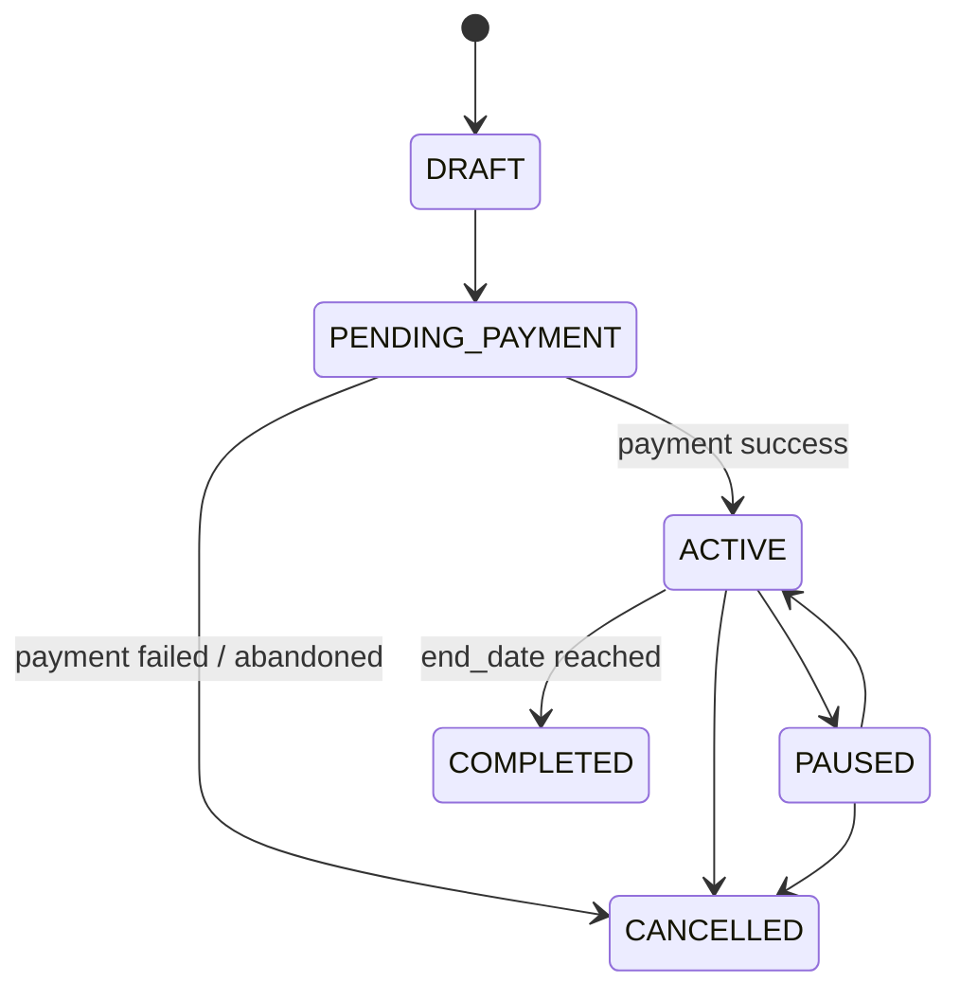
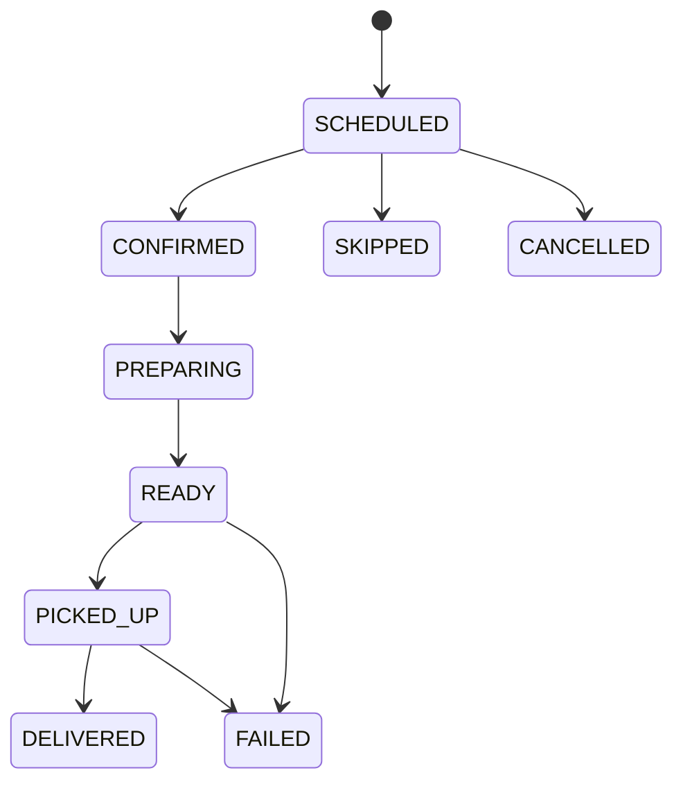

# GharKhana — Subscription Engine

## Document Control

| Field | Value |
|---|---|
| Status | v1.0 — the core business engine of GharKhana |
| Related docs | DOMAIN_MODEL.md §9–11, DATABASE.md §8–10, ARCHITECTURE.md §7 |

## 1. Purpose

The subscription engine converts a recurring meal plan (the `Subscription` + `SubscriptionSchedule`) into individual `MealOccurrence` rows — the operational unit that preparation, delivery, notifications, and billing all key off. It is the single most business-critical piece of backend logic in the platform; every other module (payments, delivery, notifications) is downstream of it.

## 2. Example

Subscription: Oct 1–31, Monday–Friday, Lunch, default meal Dal Bhat.

The engine generates individual occurrences:

```text
Oct 1  (Thu) → Dal Bhat
Oct 2  (Fri) → Dal Bhat
Oct 5  (Mon) → Dal Bhat
...
Oct 30 (Fri) → Dal Bhat
```

(Weekend dates are skipped because the schedule does not include Saturday/Sunday in this example.)

## 3. Schedule Template

A subscription contains a recurring schedule keyed by day-of-week:

```text
Monday    → Dal Bhat
Tuesday   → Chicken Curry
Wednesday → Chowmein
Thursday  → Dal Bhat
Friday    → Momo
```

This template lives in `subscription_schedules` (DATABASE.md §9) and is the source the generator reads from — it is never edited to reflect a one-off change.

## 4. Occurrence Generation

**Trigger points:**
1. Immediately on subscription activation (payment success) — generate the first rolling window.
2. Nightly cron — extend the rolling window for all `ACTIVE` subscriptions.

**Rolling window:** occurrences are generated up to **14 days ahead** of the current date (configurable), never for the entire subscription lifetime up front. This bounds the blast radius of a schedule change and keeps `meal_occurrences` growth predictable.

**Algorithm (pseudocode):**

```text
function generateOccurrences(subscription, windowEnd):
    schedule = loadSchedule(subscription.id)          # day_of_week → menu_item, quantity
    cutoffPolicy = resolveCutoffPolicy(subscription.providerId, subscription.mealType)

    for date in dateRange(max(today, subscription.startDate), min(windowEnd, subscription.endDate)):
        dayOfWeek = date.dayOfWeek()
        if dayOfWeek not in schedule:
            continue   # this subscription has no meal on this day

        scheduleEntry = schedule[dayOfWeek]
        cutoffAt = computeCutoff(date, cutoffPolicy)
        unitPrice = loadCurrentPrice(scheduleEntry.defaultMenuItemId)   # snapshot NOW

        # INSERT ... ON CONFLICT (subscription_id, scheduled_date) DO NOTHING
        upsertMealOccurrence(
            subscriptionId = subscription.id,
            scheduledDate = date,
            menuItemId = scheduleEntry.defaultMenuItemId,
            quantity = scheduleEntry.quantity,
            unitPrice = unitPrice,
            totalPrice = unitPrice * scheduleEntry.quantity,
            status = "SCHEDULED",
            customizationSource = "DEFAULT",
            cutoffAt = cutoffAt
        )
```

**Idempotency:** generation MUST be safe to run twice for the same date range. This is guaranteed by:
- The unique constraint on `(subscription_id, scheduled_date)` (DATABASE.md §10).
- Using `INSERT ... ON CONFLICT DO NOTHING` (natively supported in Drizzle ORM via `.onConflictDoNothing()`) rather than "check-then-insert," which is vulnerable to race conditions between concurrent job runs.

A scheduler running twice, or two workers picking up the same job due to an at-least-once queue, must never create duplicate occurrences or double-charge anyone. This is a release-blocking correctness requirement, not an optimization.

## 5. Customization

Customer customization changes the specific `MealOccurrence` row only — never the `SubscriptionSchedule` template.

```text
Template:               Monday → Dal Bhat   (unchanged)
This Monday's occurrence: Dal Bhat → Chicken Curry   (customer override)
```

`customizationSource` is set to `CUSTOMER_OVERRIDE`, `unitPrice`/`totalPrice` are recomputed from the new `MenuItem.price` at the moment of the change, and if the new total exceeds what was already collected for that occurrence, the delta must be collected before the change is confirmed (see PAYMENTS.md §4 for how per-occurrence deltas are reconciled against subscription-level billing).

**Schedule changes mid-cycle:** if a customer edits the recurring template itself (`PUT /subscriptions/:id/schedule`), the change applies only to occurrences **not yet generated** at the time of the change. Already-generated future occurrences keep their existing (pre-change) values unless the customer also individually customizes them — this avoids silently rewriting a meal a customer may already be expecting.

## 6. Skip

Skipping a date transitions that occurrence:

```text
SCHEDULED → SKIPPED
```

only if `now() < cutoffAt`. The parent `Subscription` remains `ACTIVE` and unaffected. Whether a skip generates a credit/refund for that specific occurrence's value is a billing policy decision (PAYMENTS.md §5) — the engine's only responsibility is the correct status transition and leaving an audit trail.

## 7. Pause

Pausing a subscription (`ACTIVE → PAUSED`):
- Stops future occurrence generation immediately (the nightly job skips `PAUSED` subscriptions).
- Does **not** retroactively cancel already-generated occurrences that fall before the pause takes effect and before their own cutoff — those follow normal cutoff/cancellation rules independently.
- Occurrences already past their cutoff at pause time proceed to fulfillment as scheduled (the provider has already committed capacity/preparation).

## 8. Resume

Resuming (`PAUSED → ACTIVE`) re-enables the nightly generation job for that subscription starting from `max(today, subscription.endDate is unchanged)`. Resuming does **not** automatically extend `endDate` to compensate for paused days unless the platform's compensation policy (a product decision, tracked as an open question in PRD.md) says otherwise — the MVP default is: paused days are simply not billed/generated, and `endDate` stays fixed.

## 9. Cutoff Calculation

Each provider (optionally per meal type) defines a `CutoffPolicy` (DOMAIN_MODEL.md §5) as **either** a fixed offset before the meal, **or** a fixed time-of-day the day before.

```text
Example A — offset-based:
  cutoffOffsetHours = 12
  Meal scheduled: 2026-10-06 (Tuesday), delivery target ~13:00
  cutoffAt = deliveryTargetDateTime - 12h = 2026-10-06 01:00

Example B — time-of-day-based:
  cutoffTimeOfDay = 20:00, timezone = Asia/Kathmandu
  Meal scheduled: Monday
  cutoffAt = Sunday 20:00 Asia/Kathmandu, converted to UTC for storage
```

`cutoffAt` is computed and **stored** on the `MealOccurrence` row at generation time (a snapshot), not recomputed on every read — this ensures that a later change to the provider's `CutoffPolicy` never retroactively changes the deadline a customer was already shown for an existing occurrence. All comparisons (`now() < cutoffAt`) happen server-side in UTC; the client only ever displays the already-localized value.

After cutoff:
- The occurrence's `menuItemId`/`quantity` cannot be changed (`422 MODIFICATION_CUTOFF_PASSED`).
- The occurrence cannot be skipped unless an explicit admin/provider override path is used (an audited admin action, not a customer-facing one).

## 10. Pricing & Quantity

- `quantity` may be set at the subscription level (schedule default) and overridden per date if the provider's policy allows it.
- The server **always** recalculates `unitPrice`/`totalPrice` from the current, authoritative `MenuItem.price` at the moment of generation or customization — it never trusts a client-submitted price.
- A later change to `MenuItem.price` does **not** retroactively change `unitPrice` on already-generated occurrences; those are snapshots. Only occurrences generated or customized *after* the price change pick up the new price.

## 11. Capacity

Provider capacity (`Provider.dailyCapacity`, per meal type) must be checked before confirming any occurrence that would consume it — both at generation time (new occurrences from active subscriptions) and at customization time (a customer switching to a different item on a date that's already near capacity).

```text
Example:
  Provider LUNCH capacity = 30
  Confirmed LUNCH occurrences for 2026-10-06 = 28
  A new subscription requesting 5 additional LUNCH meals on that date
  cannot be fully accepted without an explicit capacity-exception rule.
```

**Concurrency safety:** capacity checks and the occurrence insert that consumes that capacity must happen inside the same database transaction, using either a `SELECT ... FOR UPDATE` on a per-provider-per-date capacity counter row or a serializable/repeatable-read transaction with retry-on-conflict, so that two concurrent requests cannot both "see" the same 2 remaining slots and both succeed, overshooting capacity.

## 12. State Transitions

**Subscription:**



**MealOccurrence:**



Every transition on both entities is written inside a database transaction alongside its `audit_logs` entry and its domain event emission (DOMAIN_MODEL.md §23) — never as three separate, independently-failable steps.

## 13. Edge Cases

| Case | Handling |
|---|---|
| Subscription starts mid-week | Generation begins from `max(today, startDate)`; earlier days-of-week in that first week are simply not generated. |
| Subscription end date falls mid-rolling-window | Generation stops at `endDate`; no occurrences generated beyond it. |
| Provider goes on an unplanned off-day (holiday) | Requires a provider-declared "unavailable date" (tracked as a Phase 3+ enhancement to `Provider`); until then, handled manually via admin-initiated bulk skip + notification. |
| Menu item deleted while future occurrences reference it | Soft-delete (`availability=false`) only; hard deletion of a `MenuItem` referenced by any `MealOccurrence` is blocked at the database/application layer. |
| Clock/timezone edge (cutoff falls exactly at midnight) | All cutoff math is done in UTC after timezone conversion; no reliance on server-local time. |
| Duplicate job execution (queue redelivery) | No-op by design — see §4 idempotency guarantee. |

## 14. Server Authority

The backend is authoritative for: price, availability, capacity, cutoff, subscription status, payment status, and meal status. The mobile client must never be trusted for any of these values — every mutating endpoint recomputes and re-validates them server-side regardless of what the client submits (ARCHITECTURE.md §17, SECURITY.md §3).
