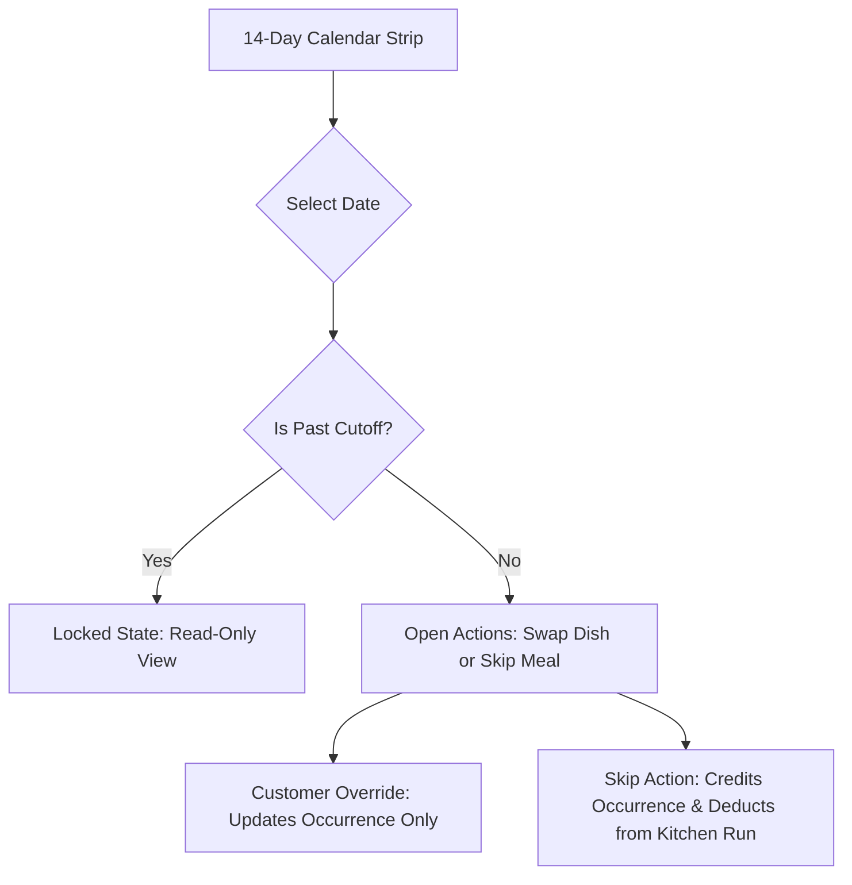
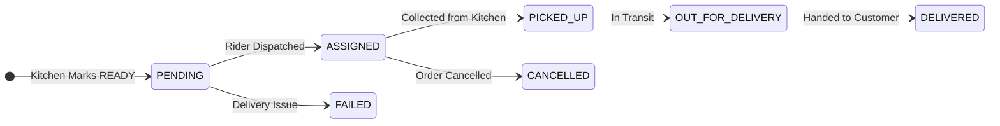

# GharKhana — Structured UI/UX Documentation

Comprehensive UI/UX architectural overview of the GharKhana mobile application, detailing user flows, screen anatomy, components, and state machines across all three core platform personas: **Consumer (Customer)**, **Kitchen Provider (Cook)**, and **Delivery Partner**.

---

## 📑 Table of Contents

1. [Architectural Philosophy](#1-architectural-philosophy)
2. [Consumer (Customer) UI Architecture](#2-consumer-customer-ui-architecture)
   - [Customer Navigation Structure](#customer-navigation-structure)
   - [Home Dashboard (`home.tsx`)](#home-dashboard-hometsx)
   - [Kitchen Discovery & Serviceability (`discover.tsx`)](#kitchen-discovery--serviceability-discovertsx)
   - [14-Day Calendar & Daily Occurrence Engine (`calendar.tsx`)](#14-day-calendar--daily-occurrence-engine-calendartsx)
   - [Provider Detail Screen (`provider-detail.tsx`)](#provider-detail-screen-provider-detailtsx)
   - [4-Step Subscription Creation Wizard (`subscribe.tsx`)](#4-step-subscription-creation-wizard-subscribetsx)
   - [Notifications Inbox (`notifications.tsx`)](#notifications-inbox-notificationstsx)
   - [Customer Profile & Address Manager (`profile.tsx`)](#customer-profile--address-manager-profiletsx)
3. [Kitchen Provider UI Architecture](#3-kitchen-provider-ui-architecture)
   - [Provider Navigation Structure](#provider-navigation-structure)
   - [Daily Preparation Dashboard (`dashboard.tsx`)](#daily-preparation-dashboard-dashboardtsx)
   - [Menu Catalog & Live Stock Toggle (`menu.tsx`)](#menu-catalog--live-stock-toggle-menutsx)
   - [Subscribers Roster (`subscriptions.tsx`)](#subscribers-roster-subscriptionstsx)
   - [Kitchen Profile, Capacity & Earnings (`profile.tsx`)](#kitchen-profile-capacity--earnings-profiletsx)
4. [Delivery Partner UI & Lifecycle](#4-delivery-partner-ui--lifecycle)
   - [5-Stage Delivery State Machine](#5-stage-delivery-state-machine)
   - [Delivery Tracking Card (`DeliveryStatusCard.tsx`)](#delivery-tracking-card-deliverystatuscardtsx)
   - [Partner Shortcut Transition](#partner-shortcut-transition)
   - [Bidirectional Status Mirroring](#bidirectional-status-mirroring)
   - [Privacy & Data Minimization](#privacy--data-minimization)
5. [Light Mode Design System](#5-light-mode-design-system)
   - [Color Tokens](#color-tokens)
   - [Typography & Touch Accessibility](#typography--touch-accessibility)
   - [Surfaces & Elevation](#surfaces--elevation)

---

## 1. Architectural Philosophy

GharKhana is intentionally designed with a **"Subscription Planner & Meal Management"** mental model rather than an impulse food delivery model.

```text
Traditional Food Delivery:
Customer ➔ Impulse Order ➔ Restaurant ➔ Rider Delivery

GharKhana Meal Subscription:
Customer ➔ Recurring Agreement (Weekly/Monthly) ➔ Daily Meal Occurrences ➔ Kitchen Daily Batch Run ➔ Neighborhood Delivery
```

### The Inviolable Core Domain Rule:
$$\text{Subscription} \neq \text{Meal Occurrence}$$

* **Subscription:** The recurring contract template (who, with whom, which weekdays, which default meals, for how long).
* **MealOccurrence:** The concrete operational unit representing **one meal on one specific calendar date** (e.g., *Lunch on Wednesday, September 24, 2026*).

Modifying, customizing, or skipping a meal on a specific day modifies only that singular `MealOccurrence`. The master recurring schedule template remains 100% pristine.

---

## 2. Consumer (Customer) UI Architecture

### Customer Navigation Structure
The customer experience is hosted under the `/(customer)` route group using a fixed bottom tab bar with 5 primary views:

```text
┌────────────────────────────────────────────────────────────────────────┐
│                        Customer Tab Navigation                         │
├──────────────┬──────────────┬──────────────┬─────────────┬─────────────┤
│ 🏠 Home      │ 🧭 Discover  │ 📅 My Meals  │ 🔔 Alerts   │ 👤 Profile  │
└──────────────┴──────────────┴──────────────┴─────────────┴─────────────┘
```

---

### Home Dashboard (`home.tsx`)
The home screen answers the user's primary question immediately: *"What am I eating today, and when is it arriving?"*

* **Today's Active Meal Card:**
  * Displays today's meal slot (Lunch or Dinner) and the scheduled dish name.
  * Live status badge: `SCHEDULED`, `PREPARING`, `OUT_FOR_DELIVERY`, or `DELIVERED`.
  * Assigned delivery partner name and estimated delivery window.
* **Cutoff Warning Countdown Banner:**
  * A prominent alert indicating how much time remains before the kitchen's cutoff locks changes for the upcoming meal (e.g., *"Lunch cutoff in 2h 15m"*).
* **3-Day Upcoming Meal Strip:**
  * A horizontal preview of the next 3 days of meals, allowing customers to quickly see what's planned without navigating to the full calendar.
* **Empty State CTA:**
  * When a user has no active subscription, the dashboard renders an engaging empty state guiding them directly to discover local home kitchens.

---

### Kitchen Discovery & Serviceability (`discover.tsx`)
Enables customers to search and filter home kitchens operating within their delivery range.

* **Haversine Distance Serviceability Engine:**
  * Calculates real-time radial distance between the customer's coordinates and the kitchen's base location.
  * Displays a serviceability pill (e.g., `1.8 km away • Serviceable`).
* **Search & Filter Controls:**
  * **Dietary Pills:** 1-tap filter for Vegetarian kitchens.
  * **Cuisine Badges:** Filter by Nepali Classic, Thakali, Newari, or Healthy Home-style.
* **Kitchen Card Anatomy:**
  * Kitchen display name, badge (Home Cook vs. Commercial Kitchen), average review rating (e.g., `★ 4.8 (42)`), daily capacity, and starting weekly/monthly subscription rates.

---

### 14-Day Calendar & Daily Occurrence Engine (`calendar.tsx`)
The core interaction hub where customers manage their upcoming 14 days of food.



* **4-State Glyph System (Color + Icon Accessibility):**
  1. `✓ Confirmed` (Green `#10B981`): Scheduled meal confirmed for preparation.
  2. `✎ Customized` (Blue `#3B82F6`): Customer selected a custom dish swap for this date.
  3. `— Skipped` (Slate `#64748B`): Meal skipped by customer; excluded from billing/prep.
  4. `! Cutoff / Attention` (Amber `#F59E0B`): Cutoff approaching; changes locking soon.
* **Interactive Date Modal:**
  * **Pre-Cutoff:** Customers can freely swap their dish from the provider's active catalog (`Swap Dish`) or skip the meal (`Skip Meal`). Skipped meals can be restored (`Restore Meal`).
  * **Post-Cutoff:** The modal visually locks the controls, disables mutating actions, and displays the exact cutoff timestamp to prevent kitchen disruption.

---

### Provider Detail Screen (`provider-detail.tsx`)
A dedicated kitchen profile screen providing transparency before subscribing.

* **Kitchen Hero & Bio:**
  * Kitchen brand name, hygiene verification badge, operating hours, and kitchen biography.
* **Live Catalog Showcase:**
  * Full list of rotating dishes with high-resolution imagery, pricing, ingredients, and vegetarian badges.
* **Customer Reviews Section (`ReviewSection.tsx`):**
  * Displays verified subscriber ratings, aggregated averages, and verified comments.
* **Floating Subscription Action Bar:**
  * Persistent bottom bar displaying starting plan rates with a prominent `[Subscribe Now]` button.

---

### 4-Step Subscription Creation Wizard (`subscribe.tsx`)
A linear, guided wizard to create recurring meal contracts:

1. **Step 1 — Plan Duration & Slot:** Choose Weekly (7-day cycle) or Monthly (30-day cycle), and meal slot (Lunch or Dinner).
2. **Step 2 — Weekly Schedule:** Select active delivery days (e.g., Sunday through Friday).
3. **Step 3 — Delivery Location:** Choose or input delivery address, landmark notes, and contact instructions.
4. **Step 4 — Price Breakdown & eSewa Gateway:**
   * Server calculates authoritative pricing based on number of active days and meal unit prices.
   * Prompts eSewa simulated payment trigger.
   * Upon payment success, automatically generates the first 14 days of `MealOccurrence` records and redirects to the calendar.

---

### Notifications Inbox (`notifications.tsx`)
In-app communication center with priority-tiered message routing:

* **Notification Categories:** Cutoff reminders, preparation alerts, out-for-delivery notifications, payment receipts, and system announcements.
* **Quiet-Hours Intelligence:** Non-critical notifications are held during nighttime quiet hours (22:00 to 07:00), while `HIGH` priority alerts (e.g., delivery arrival) bypass quiet hours.

---

### Customer Profile & Address Manager (`profile.tsx`)
* User personal information (Name, Email, Phone).
* Saved delivery addresses with GPS pin accuracy and landmark notes.
* Active subscription details, payment history, and one-tap sign out.

---

## 3. Kitchen Provider UI Architecture

### Provider Navigation Structure
The kitchen provider experience is hosted under the `/(provider)` route group:

```text
┌────────────────────────────────────────────────────────────────────────┐
│                        Provider Tab Navigation                         │
├──────────────────┬─────────────────┬──────────────────┬────────────────┤
│ 👨‍🍳 Preparation   │ 📋 Menu Catalog │ 👥 Subscribers   │ 🏪 Kitchen     │
└──────────────────┴─────────────────┴──────────────────┴────────────────┘
```

---

### Daily Preparation Dashboard (`dashboard.tsx`)
Engineered specifically for morning kitchen batching and preparation planning.

* **Portion Aggregation Summary:**
  * Displays total portion requirements for today's lunch or dinner (e.g., *"Total 45 Portions to prepare today"*).
* **Dish Breakdown Grid:**
  * Automatically aggregates portions by distinct menu items:
    * *Classic Dal Bhat Tarkari:* 32 portions
    * *Special Local Chicken Thali:* 13 portions
* **Real-time Deduplication:**
  * Excludes skipped meals automatically.
  * Dynamically groups customer dish overrides.
* **Kitchen Status Machine Controls:**
  * `[Start Preparing]` ➔ Transitions status to `PREPARING`.
  * `[Mark Ready]` ➔ Transitions status to `READY` and triggers delivery partner dispatch.

---

### Menu Catalog & Live Stock Toggle (`menu.tsx`)
Enables cooks to manage their daily menu offerings and ingredient availability in real-time.

* **Live Stock Switch (`Item.available`):**
  * When an ingredient runs out in the kitchen, the cook toggles the dish off with 1 tap.
  * The dish is immediately disabled in all customer-facing customization dropdowns.
* **Add / Edit Dish Bottom Sheet:**
  * Input fields for dish name, description, unit price in NPR, meal slot (Lunch/Dinner), and vegetarian classification.
* **Category Filtering:** Filter dishes by Vegetarian, Non-Vegetarian, or Meal Slot.

---

### Subscribers Roster (`subscriptions.tsx`)
* List of all active subscribers receiving food from this kitchen.
* Details subscriber names, delivery addresses, dietary restrictions, and subscription renewal dates.

---

### Kitchen Profile, Capacity & Earnings (`profile.tsx`)
* **Kitchen Identity & Verification:** Kitchen name, hygiene certificates, and KYC document status.
* **Daily Production Capacity:** Set maximum daily capacity (e.g., 50 meals/day) to prevent kitchen over-subscription.
* **Read-Only Financial Ledger:**
  * Gross subscription revenue accrued.
  * 10% platform fee commission deduction.
  * Net provider receivable balance.

---

## 4. Delivery Partner UI & Lifecycle

### 5-Stage Delivery State Machine
The delivery engine follows an auditable 5-stage state machine defined in `DELIVERY.md`:



---

### Delivery Tracking Card (`DeliveryStatusCard.tsx`)
* Mounted directly in the customer meal detail view.
* **Visual Progress Bar:** Displays a 5-step linked progress tracker:
  * `PENDING` ➔ `ASSIGNED` ➔ `PICKED_UP` ➔ `OUT_FOR_DELIVERY` ➔ `DELIVERED`.
* **Partner Information:** Shows the assigned delivery partner's name and masked contact channel.

---

### Partner Shortcut Transition
For hyper-local neighborhood deliveries (where the cook or a local family member delivers the meal nearby), the delivery state machine allows an authorized transition directly from `ASSIGNED` to `DELIVERED`, eliminating unnecessary intermediate steps.

---

### Bidirectional Status Mirroring
Whenever a delivery status advances (e.g., partner marks `DELIVERED`), the parent `MealOccurrence.status` immediately mirrors this transition. This ensures:
1. The customer's 14-day calendar reflects `DELIVERED`.
2. The kitchen preparation dashboard updates in real-time.
3. Audit logs record exact timestamped fulfillment.

---

### Privacy & Data Minimization
* **Delivery Partner:** Only sees customer delivery name, street address, landmark notes, and masked contact info.
* **Customer:** Only sees partner's first name and delivery status progress.

---

## 5. Light Mode Design System

GharKhana utilizes a clean, modern, high-contrast light theme engineered for maximum outdoor legibility and appetite appeal.

### Color Tokens (`tokens.ts`)

| Token | Hex Value | Application |
|---|---|---|
| `Colors.background` | `#F8FAFC` | App screen background (soft, crisp slate canvas) |
| `Colors.surface` | `#FFFFFF` | Card surfaces, modal sheets, and navigation bars |
| `Colors.surfaceBorder` | `#E2E8F0` | Subtle hairline dividers and card borders |
| `Colors.primary` | `#F97316` | Warm Saffron Orange (brand identity & primary buttons) |
| `Colors.secondary` | `#10B981` | Cardamom Green (vegetarian tags & confirmations) |
| `Colors.textPrimary` | `#0F172A` | Deep charcoal / slate (headings, high-contrast text) |
| `Colors.textSecondary` | `#475569` | Secondary descriptions, timestamps, and subtitles |
| `Colors.textMuted` | `#64748B` | Inactive icons, placeholders, and subtle helper text |
| `Colors.warning` | `#F59E0B` | Cutoff alerts and attention badges |
| `Colors.danger` | `#EF4444` | Errors, non-veg indicators, and failure badges |

---

### Typography & Touch Accessibility
* **Headings:** Bold typography with tight letter spacing for modern clarity.
* **Contrast Compliance:** `#0F172A` on `#FFFFFF` exceeds WCAG AAA contrast ratios (14.5:1).
* **Touch Targets:** All interactive buttons, chips, and toggles enforce a minimum touch target size of **$48 \times 48\text{ dp}$** for effortless one-handed mobile use.
* **Status Bar:** Configured with `<StatusBar style="dark" />` so native mobile indicators (clock, battery, Wi-Fi) render in dark slate against the light header.

---

### Surfaces & Elevation
Cards (`Card.tsx`) feature subtle elevation with light shadow rendering:
* `shadowColor`: `#0F172A`
* `shadowOffset`: `{ width: 0, height: 1 }`
* `shadowOpacity`: `0.04`
* `shadowRadius`: `3`
* `elevation`: `1`

This gives cards a crisp, floating separation from the `#F8FAFC` slate background without visual clutter.
