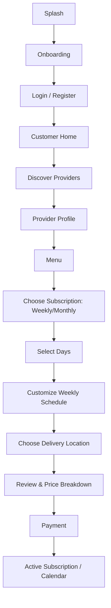
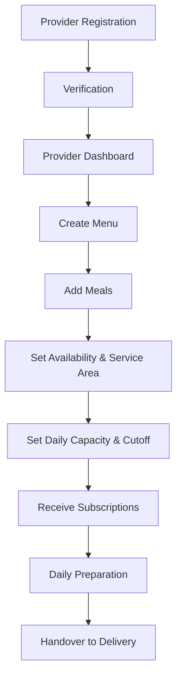

# GharKhana — Mobile UX Flow

## Document Control

| Field | Value |
|---|---|
| Status | v1.0 |
| Related docs | PRD.md §4 (personas), ARCHITECTURE.md §3–4 |

## 1. Application Model

One React Native + Expo application. After authentication, navigation is determined by `User.role`. Delivery-partner and admin surfaces are separate, lighter-weight experiences (ARCHITECTURE.md §3).

## 2. Customer Flow



## 3. Customer Home

Shows: today's meal, next meal, subscription status badge, upcoming schedule strip (next 3 days), quick actions (skip today, view calendar), and provider information (name, rating, contact-through-app link).

**Empty state (no active subscription):** a clear call-to-action to discover providers, not a blank dashboard — this is the most important empty state in the app, since a new customer with nothing to look at is the highest-risk drop-off point.

## 4. Subscription Calendar

Calendar displays per-date status glyphs:

```text
✓  Confirmed
✎  Customized
—  Skipped
!  Action required (e.g., cutoff approaching, payment issue)
```

Customer taps a date to view or modify that meal, subject to cutoff (SUBSCRIPTION_ENGINE.md §9). **Past cutoff**, the date detail view shows the locked state clearly (e.g., a visibly disabled edit control with the cutoff time shown) rather than a generic error only after the user tries to tap "edit" — the constraint should be visible before the user attempts the blocked action.

## 5. Key Error & Edge-Case Flows

| Scenario | UX behavior |
|---|---|
| Payment fails during subscription creation | Subscription stays `DRAFT`/`PENDING_PAYMENT`; customer sees a retry screen with the same computed price, not a restart of the whole flow |
| Provider rejects/doesn't serve the selected location | Serviceability is checked **before** the customer reaches the payment step (at location selection), with a clear "not available in your area" message and alternative-provider suggestion |
| Provider is at capacity for a selected date | Surfaced at schedule-review time, before payment, with the specific date(s) called out |
| Modification attempted after cutoff | Edit control shown as locked with the cutoff timestamp visible, not a dead-end error after tapping edit |
| Network unavailable | Cached read-only views (menus, past schedule) remain visible; mutating actions show a clear "reconnect to make changes" state rather than silently failing or queuing (ARCHITECTURE.md §10) |
| Subscription cancelled mid-cycle | Remaining calendar dates are visually marked cancelled; refund status (if applicable) is shown inline, not just via a separate notification |

## 6. Provider Flow



**Verification pending state:** the provider dashboard is accessible but read-only/limited (can build menus, cannot receive live subscriptions) while `verificationStatus = PENDING`/`IN_REVIEW`, with a persistent, honest status indicator rather than hiding the dashboard entirely — providers should be able to prepare their menu while waiting on verification.

## 7. Provider Dashboard

Shows: today's meals (grouped by menu item, with total quantity per item — the preparation-planning view), upcoming meals (next 3 days), active subscriber count, pending actions (new customizations needing acknowledgment, if the provider's workflow requires it), and an earnings summary (this period's accrued earnings, next payout date).

## 8. Accessibility

- Minimum touch target size 44×44dp on all interactive elements (PRD.md §10).
- Color is never the sole indicator of state — the calendar glyphs (§4) pair a symbol with color, not color alone, for colorblind users.
- All screens support system font-size scaling; layouts must not truncate critical information (price, cutoff time) at the largest supported scale.
- Screen reader labels on all icon-only controls (e.g., the calendar's skip/customize icons need text labels, not just visual glyphs).
- Minimum WCAG 2.1 AA color contrast ratios throughout.

## 9. Localization Readiness

All user-facing strings are externalized to a translation resource file from day one, even though only English ships at MVP (PRD.md §10) — this avoids a costly retrofit when Nepali-language support is prioritized. Date/number formatting uses locale-aware formatting utilities rather than hardcoded English formats.

## 10. Important UX Principle

The app should feel like a **subscription planner**, not a restaurant ordering app. The primary customer action is:

> "Manage my meals"

not:

> "Order food again."

This principle should be the tie-breaker in any design debate about whether a screen's primary CTA should emphasize browsing/ordering language versus planning/managing language — when in doubt, choose the latter.
